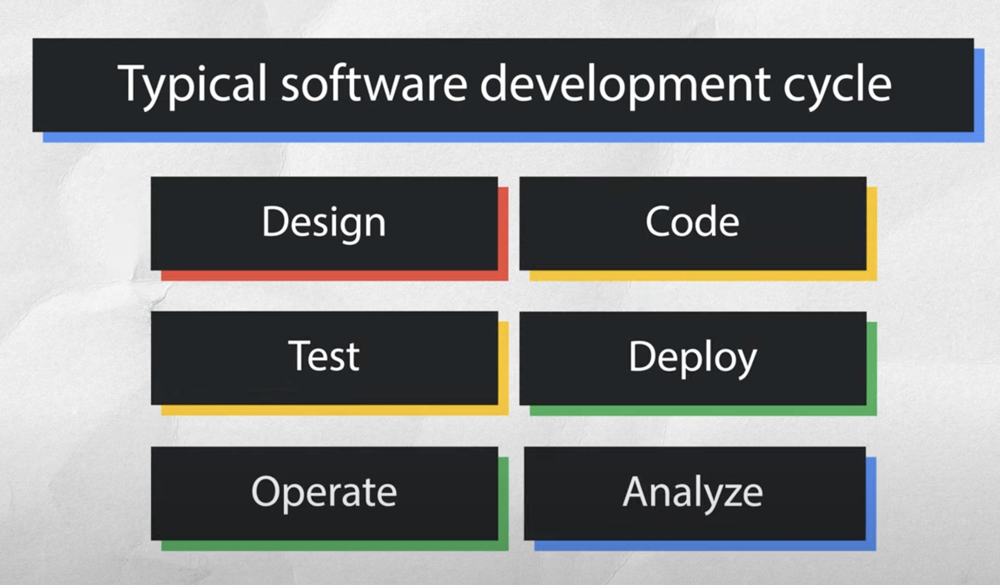

# Contributing

## Running locally

1. Install all dependencies running `npm ci` (you might need to run with `sudo`),
1. Run local dev server `npm run dev`,
1. Local dev server has to run on :4200 port due to the fact that on MongoDB <-> Google API side we add localhost:4200 as possible hardcoded redirect URL (as well as kitouch.com domain). If you need to kill some process occupying `:4200` port, run `sudo lsof -i tcp:4200` to get PID and then kill it `sudo kill -9 PID`. Do it as many times as needed.
1.

## SDLC

### Design

### Code

### Test

### Deploy

### Operate

### Analyze
